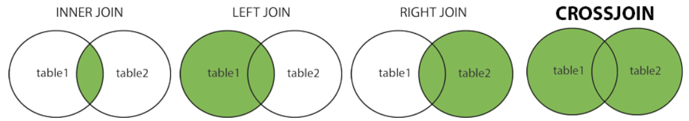

# MySQL Tutorial

- MySQL is a widely used relational database management system (RDBMS).
- MySQL is free and open-source.
- MySQL is ideal for both small and large applications.

MySQL is a very popular open-source relational database management system (RDBMS).

## What is MySQL?
- MySQL is a relational database management system.
- MySQL is open-source.
- MySQL is free.
- MySQL is ideal for both small and large applications.
- MySQL is very fast, reliable, scalable, and easy to use.
- MySQL is cross-platform.
- MySQL is compliant with the ANSI SQL standard.
- MySQL was first released in 1995.
- MySQL is developed, distributed, and supported by Oracle Corporation.
- MySQL is named after co-founder Monty Widenius's daughter: My.

## What is RDBMS?
- RDBMS stands for Relational Database Management System.
- RDBMS is a program used to maintain a relational database.
- RDBMS is the basis for all modern database systems such as MySQL, Microsoft SQL Server, Oracle, and Microsoft Access.
- RDBMS uses SQL queries to access the data in the database.

## What is a Database Table?
- A table is a collection of related data entries, and it consists of columns and rows.
- A column holds specific information about every record in the table.
- A record (or row) is each individual entry that exists in a table.

## What is a Relational Database?
- A relational database defines database relationships in the form of tables. The tables are related to each other based on data common to each.

## What is SQL?
- SQL is the standard language for dealing with Relational Databases.
- SQL is used to insert, search, update, and delete database records.

## How to Use SQL
```sql
SELECT * FROM Customers;
````

## Semicolon after SQL Statements?

  - Some database systems require a semicolon at the end of each SQL statement.
  - Semicolon is the standard way to separate each SQL statement in database systems that allow more than one SQL statement to be executed in the same call to the server.

## Some of The Most Important SQL Commands

  - `SELECT` - extracts data from a database
  - `UPDATE` - updates data in a database
  - `DELETE` - deletes data from a database
  - `INSERT INTO` - inserts new data into a database
  - `CREATE DATABASE` - creates a new database
  - `ALTER DATABASE` - modifies a database
  - `CREATE TABLE` - creates a new table
  - `ALTER TABLE` - modifies a table
  - `DROP TABLE` - deletes a table
  - `CREATE INDEX` - creates an index (search key)
  - `DROP INDEX` - deletes an index

## MySQL SELECT Statement

  - The `SELECT` statement is used to select data from a database.
  - The data returned is stored in a result table, called the result-set.

<!-- end list -->

```sql
SELECT * FROM table_name;
```

```sql
SELECT CustomerName, City, Country FROM Customers;
```

## The MySQL SELECT DISTINCT Statement

  - The `SELECT DISTINCT` statement is used to return only distinct (different) values.
  - Inside a table, a column often contains many duplicate values; and sometimes you only want to list the different (distinct) values.

<!-- end list -->

```sql
SELECT DISTINCT column1, column2
FROM table_name;
```

```sql
SELECT DISTINCT Country FROM Customers;
```

```sql
SELECT COUNT(DISTINCT Country) FROM Customers;
```

## The MySQL WHERE Clause

  - The `WHERE` clause is used to filter records.
  - It is used to extract only those records that fulfill a specified condition.

<!-- end list -->

```sql
SELECT column1, column2, ...
FROM table_name
WHERE condition;
```

```sql
SELECT * FROM Customers
WHERE Country = 'Mexico';
```

```sql
SELECT * FROM Customers
WHERE CustomerID = 1;
```

### Operators in The WHERE Clause

| Operator | Description |
|---|---|
| `=` | Equal |
| `>` | Greater than |
| `<` | Less than |
| `>=` | Greater than or equal |
| `<=` | Less than or equal |
| `<>` | Not equal. Note: In some versions of SQL this operator may be written as `!=` |
| `BETWEEN` | Between a certain range |
| `LIKE` | Search for a pattern |
| `IN` | To specify multiple possible values for a column |

## MySQL AND, OR and NOT Operators

  - The `WHERE` clause can be combined with `AND`, `OR`, and `NOT` operators.
  - The `AND` and `OR` operators are used to filter records based on more than one condition:
  - The `AND` operator displays a record if all the conditions separated by `AND` are TRUE.
  - The `OR` operator displays a record if any of the conditions separated by `OR` is TRUE.
  - The `NOT` operator displays a record if the condition(s) is NOT TRUE.

<!-- end list -->

```sql
SELECT * FROM Customers
WHERE Country = 'Germany' AND City = 'Berlin';
```

```sql
SELECT * FROM Customers
WHERE City = 'Berlin' OR City = 'Stuttgart';
```

```sql
SELECT * FROM Customers
WHERE NOT Country = 'Germany';
```

### Combining AND, OR and NOT

  - You can also combine the `AND`, `OR` and `NOT` operators.

<!-- end list -->

```sql
SELECT * FROM Customers
WHERE Country = 'Germany' AND (City = 'Berlin' OR City = 'Stuttgart');
```

## MySQL ORDER BY Keyword

  - The `ORDER BY` keyword is used to sort the result-set in ascending or descending order.
  - The `ORDER BY` keyword sorts the records in ascending order by default. To sort the records in descending order, use the `DESC` keyword.

<!-- end list -->

```sql
SELECT * FROM Customers
ORDER BY Country;
```

```sql
SELECT * FROM Customers
ORDER BY Country DESC;
```

```sql
SELECT * FROM Customers
ORDER BY Country ASC, CustomerName DESC;
```

## MySQL INSERT INTO Statement

  - The `INSERT INTO` statement is used to insert new records in a table.
  - It is possible to write the `INSERT INTO` statement in two ways:
      - Specify both the column names and the values to be inserted:
        ```sql
        INSERT INTO table_name (column1, column2, column3, ...)
        VALUES (value1, value2, value3, ...);
        ```
      - Make sure the order of the values is in the same order as the columns in the table.
        ```sql
        INSERT INTO table_name
        VALUES (value1, value2, value3, ...);
        ```

<!-- end list -->

```sql
INSERT INTO Customers (CustomerName, ContactName, Address, City, PostalCode, Country)
VALUES ('Cardinal', 'Tom B. Erichsen', 'Skagen 21', 'Stavanger', '4006', 'Norway');
```

```sql
INSERT INTO Customers
VALUES ('Cardinal', 'Tom B. Erichsen', 'Skagen 21', 'Stavanger', '4006', 'Norway');
```

```sql
INSERT INTO Customers (CustomerName, City, Country)
VALUES ('Cardinal', 'Stavanger', 'Norway');
```

## MySQL NULL Values

  - **What is a NULL Value?**: A field with a `NULL` value is a field with no value.

### The IS NULL Operator

```sql
SELECT CustomerName, ContactName, Address
FROM Customers
WHERE Address IS NULL;
```

### The IS NOT NULL Operator

```sql
SELECT CustomerName, ContactName, Address
FROM Customers
WHERE Address IS NOT NULL;
```

## MySQL UPDATE Statement

  - The `UPDATE` statement is used to modify the existing records in a table.

<!-- end list -->

```sql
UPDATE Customers
SET ContactName = 'Alfred Schmidt', City = 'Frankfurt'
WHERE CustomerID = 1;
```

```sql
UPDATE Customers
SET PostalCode = 00000
WHERE Country = 'Mexico';
```

### Update Warning\!

  - Be careful when updating records. If you omit the `WHERE` clause, **ALL** records will be updated\!

<!-- end list -->

```sql
UPDATE Customers
SET PostalCode = 00000;
```

## MySQL DELETE Statement

  - The `DELETE` statement is used to delete existing records in a table.

<!-- end list -->

```sql
DELETE FROM Customers
WHERE CustomerName='Alfreds Futterkiste';
```

### Delete All Records

  - It is possible to delete all rows in a table without deleting the table. This means that the table structure, attributes, and indexes will be intact:

<!-- end list -->

```sql
DELETE FROM Customers;
```

## MySQL LIMIT Clause

  - The `LIMIT` clause is used to specify the number of records to return.
  - The `LIMIT` clause is useful on large tables with thousands of records. Returning a large number of records can impact performance.

<!-- end list -->

```sql
SELECT * FROM Customers
LIMIT 3;
```

```sql
SELECT * FROM Customers
WHERE Country='Germany'
LIMIT 3;
```

## MySQL MIN() and MAX() Functions

  - The `MIN()` function returns the smallest value of the selected column.
  - The `MAX()` function returns the largest value of the selected column.

<!-- end list -->

```sql
SELECT MIN(Price) AS SmallestPrice
FROM Products;
```

```sql
SELECT MAX(Price) AS LargestPrice
FROM Products;
```

## MySQL COUNT(), AVG() and SUM() Functions

  - The `COUNT()` function returns the number of rows that matches a specified criterion.
  - The `AVG()` function returns the average value of a numeric column.
  - The `SUM()` function returns the total sum of a numeric column.

<!-- end list -->

```sql
SELECT COUNT(ProductID)
FROM Products;
```

```sql
SELECT AVG(Price)
FROM Products;
```

```sql
SELECT SUM(Quantity)
FROM OrderDetails;
```

## MySQL LIKE Operator

  - The `LIKE` operator is used in a `WHERE` clause to search for a specified pattern in a column.
  - There are two wildcards often used in conjunction with the `LIKE` operator:
      - The percent sign (`%`) represents zero, one, or multiple characters
      - The underscore sign (`_`) represents one, single character
  - The percent sign and the underscore can also be used in combinations\!

The following SQL statement selects all customers with a CustomerName starting with "a":

```sql
SELECT * FROM Customers
WHERE CustomerName LIKE 'a%';
```

The following SQL statement selects all customers with a CustomerName ending with "a":

```sql
SELECT * FROM Customers
WHERE CustomerName LIKE '%a';
```

The following SQL statement selects all customers with a CustomerName that have "or" in any position:

```sql
SELECT * FROM Customers
WHERE CustomerName LIKE '%or%';
```

The following SQL statement selects all customers with a CustomerName that have "r" in the second position:

```sql
SELECT * FROM Customers
WHERE CustomerName LIKE '_r%';
```

The following SQL statement selects all customers with a CustomerName that starts with "a" and are at least 3 characters in length:

```sql
SELECT * FROM Customers
WHERE CustomerName LIKE 'a__%';
```

The following SQL statement selects all customers with a ContactName that starts with "a" and ends with "o":

```sql
SELECT * FROM Customers
WHERE ContactName LIKE 'a%o';
```

The following SQL statement selects all customers with a CustomerName that does NOT start with "a":

```sql
SELECT * FROM Customers
WHERE CustomerName NOT LIKE 'a%';
```

## MySQL Wildcards

  - A wildcard character is used to substitute one or more characters in a string.
  - Wildcard characters are used with the `LIKE` operator. The `LIKE` operator is used in a `WHERE` clause to search for a specified pattern in a column.

| Symbol | Description | Example |
|---|---|---|
| `%` | Represents zero or more characters | `bl%` finds bl, black, blue, and blob |
| `_` | Represents a single character | `h_t` finds hot, hat, and hit |

| LIKE Operator | Description |
|---|---|
| `WHERE CustomerName LIKE 'a%'` | Finds any values that starts with "a" |
| `WHERE CustomerName LIKE '%a'` | Finds any values that ends with "a" |
| `WHERE CustomerName LIKE '%or%'` | Finds any values that have "or" in any position |
| `WHERE CustomerName LIKE '_r%'` | Finds any values that have "r" in the second position |
| `WHERE CustomerName LIKE 'a_%_%'`| Finds any values that starts with "a" and are at least 3 characters in length |
| `WHERE ContactName LIKE 'a%o'` | Finds any values that starts with "a" and ends with "o" |

The following SQL statement selects all customers with a City starting with "ber":

```sql
SELECT * FROM Customers
WHERE City LIKE 'ber%';
```

The following SQL statement selects all customers with a City containing the pattern "es":

```sql
SELECT * FROM Customers
WHERE City LIKE '%es%';
```

The following SQL statement selects all customers with a City starting with any character, followed by "ondon":

```sql
SELECT * FROM Customers
WHERE City LIKE '_ondon';
```

The following SQL statement selects all customers with a City starting with "L", followed by any character, followed by "n", followed by any character, followed by "on":

```sql
SELECT * FROM Customers
WHERE City LIKE 'L_n_on';
```

## MySQL IN Operator

  - The `IN` operator allows you to specify multiple values in a `WHERE` clause.
  - The `IN` operator is a shorthand for multiple `OR` conditions.

<!-- end list -->

```sql
SELECT column_name(s)
FROM table_name
WHERE column_name IN (value1, value2, ...);
```

```sql
SELECT column_name(s)
FROM table_name
WHERE column_name IN (SELECT STATEMENT);
```

```sql
SELECT * FROM Customers
WHERE Country IN ('Germany', 'France', 'UK');
```

```sql
SELECT * FROM Customers
WHERE Country NOT IN ('Germany', 'France', 'UK');
```

```sql
SELECT * FROM Customers
WHERE Country IN (SELECT Country FROM Suppliers);
```

## MySQL BETWEEN Operator

  - The `BETWEEN` operator selects values within a given range. The values can be numbers, text, or dates.
  - The `BETWEEN` operator is inclusive: begin and end values are included.

<!-- end list -->

```sql
SELECT * FROM Products
WHERE Price BETWEEN 10 AND 20;
```

```sql
SELECT * FROM Products
WHERE Price NOT BETWEEN 10 AND 20;
```

```sql
SELECT * FROM Products
WHERE Price BETWEEN 10 AND 20
AND CategoryID NOT IN (1,2,3);
```

```sql
SELECT * FROM Products
WHERE ProductName BETWEEN 'Carnarvon Tigers' AND 'Mozzarella di Giovanni'
ORDER BY ProductName;
```

```sql
SELECT * FROM Products
WHERE ProductName NOT BETWEEN 'Carnarvon Tigers' AND 'Mozzarella di Giovanni'
ORDER BY ProductName;
```

```sql
SELECT * FROM Orders
WHERE OrderDate BETWEEN '1996-07-01' AND '1996-07-31';
```

## MySQL Aliases

  - Aliases are used to give a table, or a column in a table, a temporary name.
  - Aliases are often used to make column names more readable.
  - An alias only exists for the duration of that query.
  - An alias is created with the `AS` keyword.

<!-- end list -->

```sql
SELECT CustomerID AS ID, CustomerName AS Customer
FROM Customers;
```

Single or double quotation marks are required if the alias name contains spaces:

```sql
SELECT CustomerName AS Customer, ContactName AS "Contact Person"
FROM Customers;
```

The following SQL statement creates an alias named "Address" that combine four columns (Address, PostalCode, City and Country):

```sql
SELECT CustomerName, CONCAT_WS(', ', Address, PostalCode, City, Country) AS Address
FROM Customers;
```

```sql
SELECT o.OrderID, o.OrderDate, c.CustomerName
FROM Customers AS c, Orders AS o
WHERE c.CustomerName='Around the Horn' AND c.CustomerID=o.CustomerID;
```

vs

```sql
SELECT Orders.OrderID, Orders.OrderDate, Customers.CustomerName
FROM Customers, Orders
WHERE Customers.CustomerName='Around the Horn' AND Customers.CustomerID=Orders.CustomerID;
```

## MySQL Joins

  - A `JOIN` clause is used to combine rows from two or more tables, based on a related column between them.
  - By default `JOIN` is `INNER JOIN`.

<!-- end list -->

```sql
SELECT Orders.OrderID, Customers.CustomerName, Orders.OrderDate
FROM Orders
INNER JOIN Customers ON Orders.CustomerID=Customers.CustomerID;
```

  - `INNER JOIN`: Returns records that have matching values in both tables
  - `LEFT JOIN`: Returns all records from the left table, and the matched records from the right table
  - `RIGHT JOIN`: Returns all records from the right table, and the matched records from the left table
  - `CROSS JOIN`: Returns all records from both tables
  



### MySQL INNER JOIN Keyword

The `INNER JOIN` keyword selects records that have matching values in both tables.

```sql
SELECT Orders.OrderID, Customers.CustomerName
FROM Orders
INNER JOIN Customers ON Orders.CustomerID = Customers.CustomerID;
```

### MySQL LEFT JOIN Keyword

  - The `LEFT JOIN` keyword returns all records from the left table (table1), and the matching records (if any) from the right table.
  - The `LEFT JOIN` keyword returns all records from the left table (Customers), even if there are no matches in the right table (Orders).

<!-- end list -->

```sql
SELECT Customers.CustomerName, Orders.OrderID
FROM Customers
LEFT JOIN Orders ON Customers.CustomerID = Orders.CustomerID
ORDER BY Customers.CustomerName;
```

### MySQL RIGHT JOIN Keyword

  - The `RIGHT JOIN` keyword returns all records from the right table (table2), and the matching records (if any) from the left table.
  - The `RIGHT JOIN` keyword returns all records from the right table (Employees), even if there are no matches in the left table (Orders).

<!-- end list -->

```sql
SELECT Orders.OrderID, Employees.LastName, Employees.FirstName
FROM Orders
RIGHT JOIN Employees ON Orders.EmployeeID = Employees.EmployeeID
ORDER BY Orders.OrderID;
```

### MySQL CROSS JOIN Keyword

  - The `CROSS JOIN` keyword returns all records from both tables (table1 and table2).
  - The `CROSS JOIN` keyword returns all matching records from both tables whether the other table matches or not. So, if there are rows in "Customers" that do not have matches in "Orders", or if there are rows in "Orders" that do not have matches in "Customers", those rows will be listed as well.
  - If you add a `WHERE` clause (if table1 and table2 has a relationship), the `CROSS JOIN` will produce the same result as the `INNER JOIN` clause:

<!-- end list -->

```sql
SELECT Customers.CustomerName, Orders.OrderID
FROM Customers
CROSS JOIN Orders
WHERE Customers.CustomerID=Orders.CustomerID;
```

### MySQL Self Join

  - A self join is a regular join, but the table is joined with itself.

<!-- end list -->

```sql
SELECT A.CustomerName AS CustomerName1, B.CustomerName AS CustomerName2, A.City
FROM Customers A, Customers B
WHERE A.CustomerID <> B.CustomerID
AND A.City = B.City
ORDER BY A.City;
```

## The MySQL UNION Operator

The `UNION` operator is used to combine the result-set of two or more `SELECT` statements.

  - Every `SELECT` statement within `UNION` must have the same number of columns.
  - The columns must also have similar data types.
  - The columns in every `SELECT` statement must also be in the same order.

<!-- end list -->

```sql
SELECT City FROM Customers
UNION
SELECT City FROM Suppliers
ORDER BY City;
```

### UNION ALL

The `UNION` operator selects only distinct values by default. To allow duplicate values, use `UNION ALL`:

```sql
SELECT City, Country FROM Customers
WHERE Country='Germany'
UNION ALL
SELECT City, Country FROM Suppliers
WHERE Country='Germany'
ORDER BY City;
```

## MySQL GROUP BY Statement

  - The `GROUP BY` statement groups rows that have the same values into summary rows, like "find the number of customers in each country".
  - The `GROUP BY` statement is often used with aggregate functions (`COUNT()`, `MAX()`, `MIN()`, `SUM()`, `AVG()`) to group the result-set by one or more columns.

<!-- end list -->

```sql
SELECT COUNT(CustomerID), Country
FROM Customers
GROUP BY Country
ORDER BY COUNT(CustomerID) DESC;
```

```sql
SELECT Shippers.ShipperName, COUNT(Orders.OrderID) AS NumberOfOrders FROM Orders
LEFT JOIN Shippers ON Orders.ShipperID = Shippers.ShipperID
GROUP BY ShipperName;
```

## MySQL HAVING Clause

  - The `HAVING` clause was added to SQL because the `WHERE` keyword cannot be used with aggregate functions.

<!-- end list -->

```sql
SELECT COUNT(CustomerID), Country
FROM Customers
GROUP BY Country
HAVING COUNT(CustomerID) > 5
ORDER BY COUNT(CustomerID) DESC;
```

```sql
SELECT Employees.LastName, COUNT(Orders.OrderID) AS NumberOfOrders
FROM Orders
INNER JOIN Employees ON Orders.EmployeeID = Employees.EmployeeID
WHERE LastName = 'Davolio' OR LastName = 'Fuller'
GROUP BY LastName
HAVING COUNT(Orders.OrderID) > 25
```

## MySQL EXISTS Operator

  - The `EXISTS` operator is used to test for the existence of any record in a subquery.
  - The `EXISTS` operator returns `TRUE` if the subquery returns one or more records.

<!-- end list -->

```sql
SELECT SupplierName
FROM Suppliers
WHERE EXISTS (SELECT ProductName FROM Products WHERE Products.SupplierID = Suppliers.supplierID AND Price < 20);
```

## MySQL ANY and ALL Operators

  - The `ANY` and `ALL` operators allow you to perform a comparison between a single column value and a range of other values.

### The ANY Operator

  - The `ANY` operator:
      - returns a boolean value as a result
      - returns `TRUE` if `ANY` of the subquery values meet the condition
  - `ANY` means that the condition will be true if the operation is true for any of the values in the range.
  - The operator must be a standard comparison operator (`=`, `<>`, `!=`, `>`, `>=`, `<`, or `<=`).

The following SQL statement lists the ProductName if it finds `ANY` records in the OrderDetails table has Quantity equal to 10 (this will return `TRUE` because the Quantity column has some values of 10):

```sql
SELECT ProductName
FROM Products
WHERE ProductID = ANY
  (SELECT ProductID
  FROM OrderDetails
  WHERE Quantity = 10);
```

### The ALL Operator

  - The `ALL` operator:
      - returns a boolean value as a result
      - returns `TRUE` if `ALL` of the subquery values meet the condition
      - is used with `SELECT`, `WHERE` and `HAVING` statements
  - `ALL` means that the condition will be true only if the operation is true for all values in the range.

The following SQL statement lists the ProductName if `ALL` the records in the OrderDetails table has Quantity equal to 10. This will of course return `FALSE` because the Quantity column has many different values (not only the value of 10):

```sql
SELECT ProductName
FROM Products
WHERE ProductID = ALL
  (SELECT ProductID
  FROM OrderDetails
  WHERE Quantity = 10);
```

## MySQL INSERT INTO SELECT Statement

  - The `INSERT INTO SELECT` statement copies data from one table and inserts it into another table.
  - The `INSERT INTO SELECT` statement requires that the data types in source and target tables matches.
  - Note: The existing records in the target table are unaffected.

<!-- end list -->

```sql
INSERT INTO Customers (CustomerName, City, Country)
SELECT SupplierName, City, Country FROM Suppliers;
```

```sql
INSERT INTO Customers (CustomerName, City, Country)
SELECT SupplierName, City, Country FROM Suppliers
WHERE Country='Germany';
```

## MySQL CASE Statement

  - The `CASE` statement goes through conditions and returns a value when the first condition is met (like an if-then-else statement). So, once a condition is true, it will stop reading and return the result. If no conditions are true, it returns the value in the `ELSE` clause.
  - If there is no `ELSE` part and no conditions are true, it returns `NULL`.

<!-- end list -->

```sql
SELECT OrderID, Quantity,
CASE
    WHEN Quantity > 30 THEN 'The quantity is greater than 30'
    WHEN Quantity = 30 THEN 'The quantity is 30'
    ELSE 'The quantity is under 30'
END AS QuantityText
FROM OrderDetails;
```

```sql
SELECT CustomerName, City, Country
FROM Customers
ORDER BY
(CASE
    WHEN City IS NULL THEN Country
    ELSE City
END);
```

## MySQL NULL Functions

  - `IFNULL()` and `COALESCE()` Functions

### MySQL IFNULL() Function

  - The MySQL `IFNULL()` function lets you return an alternative value if an expression is `NULL`.

The example below returns 0 if the value is `NULL`:

```sql
SELECT ProductName, UnitPrice * (UnitsInStock + IFNULL(UnitsOnOrder, 0))
FROM Products;
```

### MySQL COALESCE() Function

  - Or we can use the `COALESCE()` function, like this:

<!-- end list -->

```sql
SELECT ProductName, UnitPrice * (UnitsInStock + COALESCE(UnitsOnOrder, 0))
FROM Products;
```

## MySQL Comments

  - Comments are used to explain sections of SQL statements, or to prevent execution of SQL statements.

### Single Line Comments

  - Single line comments start with `--`.
  - Any text between `--` and the end of the line will be ignored (will not be executed).

<!-- end list -->

```sql
-- Select all:
SELECT * FROM Customers;
```

### Multi-line Comments

  - Multi-line comments start with `/*` and end with `*/`.
  - Any text between `/*` and `*/` will be ignored.

<!-- end list -->

```sql
/*Select all the columns
of all the records
in the Customers table:*/
SELECT * FROM Customers;
```

```sql
SELECT CustomerName, /*City,*/ Country FROM Customers;
```

## MySQL Operators

### MySQL Logical Operators

  - `ALL`: `TRUE` if all of the subquery values meet the condition
  - `AND`: `TRUE` if all the conditions separated by `AND` is `TRUE`
  - `ANY`: `TRUE` if any of the subquery values meet the condition
  - `BETWEEN`: `TRUE` if the operand is within the range of comparisons
  - `EXISTS`: `TRUE` if the subquery returns one or more records
  - `IN`: `TRUE` if the operand is equal to one of a list of expressions
  - `LIKE`: `TRUE` if the operand matches a pattern
  - `NOT`: Displays a record if the condition(s) is `NOT TRUE`
  - `OR`: `TRUE` if any of the conditions separated by `OR` is `TRUE`
  - `SOME`: `TRUE` if any of the subquery values meet the condition

## MySQL CREATE DATABASE Statement

  - The `CREATE DATABASE` statement is used to create a new SQL database.

<!-- end list -->

```sql
CREATE DATABASE databasename;
```

## MySQL DROP DATABASE Statement

  - The `DROP DATABASE` statement is used to drop an existing SQL database.

<!-- end list -->

```sql
DROP DATABASE databasename;
```

## MySQL CREATE TABLE Statement

  - The `CREATE TABLE` statement is used to create a new table in a database.

<!-- end list -->

```sql
CREATE TABLE Persons (
    PersonID int,
    LastName varchar(255),
    FirstName varchar(255),
    Address varchar(255),
    City varchar(255)
);
```

### Create Table Using Another Table

  - A copy of an existing table can also be created using `CREATE TABLE`.
  - The new table gets the same column definitions. All columns or specific columns can be selected.
  - If you create a new table using an existing table, the new table will be filled with the existing values from the old table.

<!-- end list -->

```sql
CREATE TABLE TestTable AS
SELECT customername, contactname
FROM customers;
```

## MySQL DROP TABLE Statement

  - The `DROP TABLE` statement is used to drop an existing table in a database.

<!-- end list -->

```sql
DROP TABLE table_name;
```

## MySQL TRUNCATE TABLE

  - The `TRUNCATE TABLE` statement is used to delete the data inside a table, but not the table itself.

<!-- end list -->

```sql
TRUNCATE TABLE table_name;
```

## MySQL ALTER TABLE Statement

  - The `ALTER TABLE` statement is used to add, delete, or modify columns in an existing table.
  - The `ALTER TABLE` statement is also used to add and drop various constraints on an existing table.

<!-- end list -->

```sql
ALTER TABLE Customers
ADD Email varchar(255);
```

```sql
ALTER TABLE Customers
DROP COLUMN Email;
```

```sql
ALTER TABLE Persons
ADD DateOfBirth date;
```

### ALTER TABLE - MODIFY COLUMN

  - To change the data type of a column in a table, use the following syntax:

<!-- end list -->

```sql
ALTER TABLE Persons
MODIFY COLUMN DateOfBirth year;
```

```sql
ALTER TABLE Persons
DROP COLUMN DateOfBirth;
```

## MySQL Constraints

  - SQL constraints are used to specify rules for data in a table.

### Create Constraints

  - Constraints can be specified when the table is created with the `CREATE TABLE` statement, or after the table is created with the `ALTER TABLE` statement.

SQL constraints are used to specify rules for the data in a table. Constraints are used to limit the type of data that can go into a table. This ensures the accuracy and reliability of the data in the table. If there is any violation between the constraint and the data action, the action is aborted.
Constraints can be column level or table level. Column level constraints apply to a column, and table level constraints apply to the whole table.

The following constraints are commonly used in SQL:

  - `NOT NULL` - Ensures that a column cannot have a `NULL` value
  - `UNIQUE` - Ensures that all values in a column are different
  - `PRIMARY KEY` - A combination of a `NOT NULL` and `UNIQUE`. Uniquely identifies each row in a table
  - `FOREIGN KEY` - Prevents actions that would destroy links between tables
  - `CHECK` - Ensures that the values in a column satisfies a specific condition
  - `DEFAULT` - Sets a default value for a column if no value is specified
  - `CREATE INDEX` - Used to create and retrieve data from the database very quickly

## MySQL NOT NULL Constraint

  - By default, a column can hold `NULL` values.
  - The `NOT NULL` constraint enforces a column to NOT accept `NULL` values.
  - This enforces a field to always contain a value, which means that you cannot insert a new record, or update a record without adding a value to this field.

<!-- end list -->

```sql
CREATE TABLE Persons (
    ID int NOT NULL,
    LastName varchar(255) NOT NULL,
    FirstName varchar(255) NOT NULL,
    Age int
);
```

```sql
ALTER TABLE Persons
MODIFY Age int NOT NULL;
```

## MySQL UNIQUE Constraint

  - The `UNIQUE` constraint ensures that all values in a column are different.
  - Both the `UNIQUE` and `PRIMARY KEY` constraints provide a guarantee for uniqueness for a column or set of columns.
  - A `PRIMARY KEY` constraint automatically has a `UNIQUE` constraint.
  - However, you can have many `UNIQUE` constraints per table, but only one `PRIMARY KEY` constraint per table.

<!-- end list -->

```sql
CREATE TABLE Persons (
    ID int NOT NULL,
    LastName varchar(255) NOT NULL,
    FirstName varchar(255),
    Age int,
    UNIQUE (ID)
);
```

To name a `UNIQUE` constraint, and to define a `UNIQUE` constraint on multiple columns, use the following SQL syntax:

```sql
CREATE TABLE Persons (
    ID int NOT NULL,
    LastName varchar(255) NOT NULL,
    FirstName varchar(255),
    Age int,
    CONSTRAINT UC_Person UNIQUE (ID,LastName)
);
```

```sql
ALTER TABLE Persons
ADD UNIQUE (ID);
```

```sql
ALTER TABLE Persons
ADD CONSTRAINT UC_Person UNIQUE (ID,LastName);
```

```sql
ALTER TABLE Persons
DROP INDEX UC_Person;
```

## MySQL PRIMARY KEY Constraint

  - The `PRIMARY KEY` constraint uniquely identifies each record in a table.
  - Primary keys must contain `UNIQUE` values, and cannot contain `NULL` values.
  - A table can have only ONE primary key; and in the table, this primary key can consist of single or multiple columns (fields).

### PRIMARY KEY on CREATE TABLE

  - The following SQL creates a `PRIMARY KEY` on the "ID" column when the "Persons" table is created:

<!-- end list -->

```sql
CREATE TABLE Persons (
    ID int NOT NULL,
    LastName varchar(255) NOT NULL,
    FirstName varchar(255),
    Age int,
    PRIMARY KEY (ID)
);
```

To allow naming of a `PRIMARY KEY` constraint, and for defining a `PRIMARY KEY` constraint on multiple columns, use the following SQL syntax:

```sql
CREATE TABLE Persons (
    ID int NOT NULL,
    LastName varchar(255) NOT NULL,
    FirstName varchar(255),
    Age int,
    CONSTRAINT PK_Person PRIMARY KEY (ID,LastName)
);
```

**Note:** In the example above there is only ONE `PRIMARY KEY` (PK\_Person). However, the VALUE of the primary key is made up of TWO COLUMNS (ID + LastName).

### PRIMARY KEY on ALTER TABLE

```sql
ALTER TABLE Persons
ADD PRIMARY KEY (ID);
```

```sql
ALTER TABLE Persons
ADD CONSTRAINT PK_Person PRIMARY KEY (ID,LastName);
```

```sql
ALTER TABLE Persons
DROP PRIMARY KEY;
```

## MySQL FOREIGN KEY Constraint

  - The `FOREIGN KEY` constraint is used to prevent actions that would destroy links between tables.
  - A `FOREIGN KEY` is a field (or collection of fields) in one table, that refers to the `PRIMARY KEY` in another table.
  - The table with the foreign key is called the child table, and the table with the primary key is called the referenced or parent table.

<!-- end list -->

```sql
CREATE TABLE Orders (
    OrderID int NOT NULL,
    OrderNumber int NOT NULL,
    PersonID int,
    PRIMARY KEY (OrderID),
    FOREIGN KEY (PersonID) REFERENCES Persons(PersonID)
);
```

```sql
CREATE TABLE Orders (
    OrderID int NOT NULL,
    OrderNumber int NOT NULL,
    PersonID int,
    PRIMARY KEY (OrderID),
    CONSTRAINT FK_PersonOrder FOREIGN KEY (PersonID)
    REFERENCES Persons(PersonID)
);
```

```sql
ALTER TABLE Orders
ADD FOREIGN KEY (PersonID) REFERENCES Persons(PersonID);
```

## MySQL CHECK Constraint

  - The `CHECK` constraint is used to limit the value range that can be placed in a column.
  - If you define a `CHECK` constraint on a column it will allow only certain values for this column.
  - If you define a `CHECK` constraint on a table it can limit the values in certain columns based on values in other columns in the row.

<!-- end list -->

```sql
CREATE TABLE Persons (
    ID int NOT NULL,
    LastName varchar(255) NOT NULL,
    FirstName varchar(255),
    Age int,
    CHECK (Age>=18)
);
```

```sql
ALTER TABLE Persons
ADD CHECK (Age>=18);
```

```sql
ALTER TABLE Persons
ADD CONSTRAINT CHK_PersonAge CHECK (Age>=18 AND City='Sandnes');
```

## MySQL DEFAULT Constraint

  - The `DEFAULT` constraint is used to set a default value for a column.
  - The default value will be added to all new records, if no other value is specified.

<!-- end list -->

```sql
CREATE TABLE Persons (
    ID int NOT NULL,
    LastName varchar(255) NOT NULL,
    FirstName varchar(255),
    Age int,
    City varchar(255) DEFAULT 'Sandnes'
);
```

```sql
CREATE TABLE Orders (
    ID int NOT NULL,
    OrderNumber int NOT NULL,
    OrderDate date DEFAULT CURRENT_DATE()
);
```

```sql
ALTER TABLE Persons
ALTER City SET DEFAULT 'Sandnes';
```

```sql
ALTER TABLE Persons
ALTER City DROP DEFAULT;
```

## MySQL CREATE INDEX Statement

  - The `CREATE INDEX` statement is used to create indexes in tables.
  - Indexes are used to retrieve data from the database more quickly than otherwise. The users cannot see the indexes, they are just used to speed up searches/queries.
  - Updating a table with indexes takes more time than updating a table without (because the indexes also need an update). So, only create indexes on columns that will be frequently searched against.

### CREATE INDEX Syntax

  - Creates an index on a table. Duplicate values are allowed:

<!-- end list -->

```sql
CREATE INDEX index_name
ON table_name (column1, column2, ...);
```

  - Creates a unique index on a table. Duplicate values are NOT allowed:

<!-- end list -->

```sql
CREATE UNIQUE INDEX index_name
ON table_name (column1, column2, ...);
```

The SQL statement below creates an index named "idx\_lastname" on the "LastName" column in the "Persons" table:

```sql
CREATE INDEX idx_lastname
ON Persons (LastName);
```

If you want to create an index on a combination of columns, you can list the column names within the parentheses, separated by commas:

```sql
CREATE INDEX idx_pname
ON Persons (LastName, FirstName);
```

```sql
ALTER TABLE table_name
DROP INDEX index_name;
```

## MySQL AUTO INCREMENT Field

  - Auto-increment allows a unique number to be generated automatically when a new record is inserted into a table.
  - Often this is the primary key field that we would like to be created automatically every time a new record is inserted.
  - MySQL uses the `AUTO_INCREMENT` keyword to perform an auto-increment feature.
  - By default, the starting value for `AUTO_INCREMENT` is 1, and it will increment by 1 for each new record.

<!-- end list -->

```sql
CREATE TABLE Persons (
    Personid int NOT NULL AUTO_INCREMENT,
    LastName varchar(255) NOT NULL,
    FirstName varchar(255),
    Age int,
    PRIMARY KEY (Personid)
);
```

To let the `AUTO_INCREMENT` sequence start with another value, use the following SQL statement:

```sql
ALTER TABLE Persons AUTO_INCREMENT=100;
```

## MySQL Dates

  - MySQL comes with the following data types for storing a date or a date/time value in the database:
      - `DATE` - format YYYY-MM-DD
      - `DATETIME` - format: YYYY-MM-DD HH:MI:SS
      - `TIMESTAMP` - format: YYYY-MM-DD HH:MI:SS
      - `YEAR` - format YYYY or YY
  - Note: The date data type are set for a column when you create a new table in your database\!

<!-- end list -->

```sql
SELECT * FROM Orders WHERE OrderDate='2008-11-11'
```

## MySQL Views

  - In SQL, a view is a virtual table based on the result-set of an SQL statement.
  - A view contains rows and columns, just like a real table. The fields in a view are fields from one or more real tables in the database.
  - You can add SQL statements and functions to a view and present the data as if the data were coming from one single table.
  - A view is created with the `CREATE VIEW` statement.

<!-- end list -->

```sql
CREATE VIEW view_name AS
SELECT column1, column2, ...
FROM table_name
WHERE condition;
```

```sql
CREATE VIEW [Brazil Customers] AS
SELECT CustomerName, ContactName
FROM Customers
WHERE Country = 'Brazil';
```

```sql
SELECT * FROM [Brazil Customers];
```

### MySQL Updating a View

```sql
CREATE OR REPLACE VIEW view_name AS
SELECT column1, column2, ...
FROM table_name
WHERE condition;
```

```sql
CREATE OR REPLACE VIEW [Brazil Customers] AS
SELECT CustomerName, ContactName, City
FROM Customers
WHERE Country = 'Brazil';
```

### MySQL Dropping a View

```sql
DROP VIEW view_name;
```

```sql
DROP VIEW [Brazil Customers];
```

## MySQL Data Types

  - The data type of a column defines what value the column can hold: integer, character, money, date and time, binary, and so on.
  - Each column in a database table is required to have a name and a data type.
  - An SQL developer must decide what type of data that will be stored inside each column when creating a table.
  - The data type is a guideline for SQL to understand what type of data is expected inside of each column, and it also identifies how SQL will interact with the stored data.
  - In MySQL there are three main data types: string, numeric, and date and time.

### String Data Types

| Data type | Description |
|---|---|
| `CHAR(size)` | A FIXED length string (can contain letters, numbers, and special characters). The size parameter specifies the column length in characters - can be from 0 to 255. Default is 1 |
| `VARCHAR(size)` | A VARIABLE length string (can contain letters, numbers, and special characters). The size parameter specifies the maximum column length in characters - can be from 0 to 65535 |
| `BINARY(size)` | Equal to `CHAR()`, but stores binary byte strings. The size parameter specifies the column length in bytes. Default is 1 |
| `VARBINARY(size)` | Equal to `VARCHAR()`, but stores binary byte strings. The size parameter specifies the maximum column length in bytes. |
| `TINYBLOB` | For BLOBs (Binary Large OBjects). Max length: 255 bytes |
| `TINYTEXT` | Holds a string with a maximum length of 255 characters |
| `TEXT(size)` | Holds a string with a maximum length of 65,535 bytes |
| `BLOB(size)` | For BLOBs (Binary Large OBjects). Holds up to 65,535 bytes of data |
| `MEDIUMTEXT` | Holds a string with a maximum length of 16,777,215 characters |
| `MEDIUMBLOB` | For BLOBs (Binary Large OBjects). Holds up to 16,777,215 bytes of data |
| `LONGTEXT` | Holds a string with a maximum length of 4,294,967,295 characters |
| `LONGBLOB` | For BLOBs (Binary Large OBjects). Holds up to 4,294,967,295 bytes of data |
| `ENUM(val1, ...)` | A string object that can have only one value, chosen from a list of possible values. You can list up to 65535 values. If a value is inserted that is not in the list, a blank value will be inserted. |
| `SET(val1, ...)` | A string object that can have 0 or more values, chosen from a list of possible values. You can list up to 64 values in a `SET` list |

### Numeric Data Types

| Data type | Description |
|---|---|
| `BIT(size)` | A bit-value type. The number of bits per value is specified in size. The size parameter can hold a value from 1 to 64. The default value for size is 1. |
| `TINYINT(size)` | A very small integer. Signed range is from -128 to 127. Unsigned range is from 0 to 255. |
| `BOOL` | Zero is considered as false, nonzero values are considered as true. |
| `BOOLEAN` | Equal to `BOOL` |
| `SMALLINT(size)` | A small integer. Signed range is from -32768 to 32767. Unsigned range is from 0 to 65535. |
| `MEDIUMINT(size)`| A medium integer. Signed range is from -8388608 to 8388607. Unsigned range is from 0 to 16777215. |
| `INT(size)` | A medium integer. Signed range is from -2147483648 to 2147483647. Unsigned range is from 0 to 4294967295. |
| `INTEGER(size)` | Equal to `INT(size)` |
| `BIGINT(size)` | A large integer. Signed range is from -9223372036854775808 to 9223372036854775807. |
| `FLOAT(size, d)` | A floating point number. The total number of digits is specified in size. The number of digits after the decimal point is specified in the d parameter. |
| `FLOAT(p)` | A floating point number. MySQL uses the p value to determine whether to use `FLOAT` or `DOUBLE`. If p is 0-24, it becomes `FLOAT()`. If p is 25-53, it becomes `DOUBLE()`. |
| `DOUBLE(size, d)`| A normal-size floating point number. |
| `DECIMAL(size, d)`| An exact fixed-point number. Max for size is 65. Max for d is 30. Default size is 10, default d is 0. |
| `DEC(size, d)` | Equal to `DECIMAL(size,d)` |

### Date and Time Data Types

| Data type | Description |
|---|---|
| `DATE` | A date. Format: `YYYY-MM-DD`. Supported range is from '1000-01-01' to '9999-12-31' |
| `DATETIME(fsp)`| A date and time combination. Format: `YYYY-MM-DD hh:mm:ss`. Supported range is from '1000-01-01 00:00:00' to '9999-12-31 23:59:59'. |
| `TIMESTAMP(fsp)`| A timestamp. Stored as seconds since the Unix epoch ('1970-01-01 00:00:00' UTC). Format: `YYYY-MM-DD hh:mm:ss`. Supported range is from '1970-01-01 00:00:01' UTC to '2038-01-09 03:14:07' UTC. |
| `TIME(fsp)` | A time. Format: `hh:mm:ss`. The supported range is from '-838:59:59' to '838:59:59' |
| `YEAR` | A year in four-digit format. Values allowed: 1901 to 2155, and 0000. MySQL 8.0 does not support year in two-digit format. |

### MySQL Functions

MySQL has many built-in functions.
This reference contains string, numeric, date, and some advanced functions in MySQL.


## References:

-  https://www.w3schools.com/mySQl/default.asp