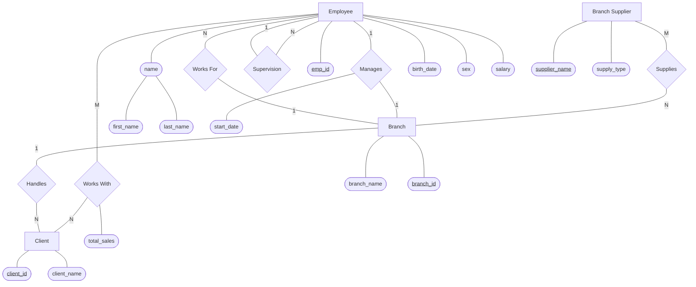

# Lesson 22: Designing an ER Diagram

**Goal:** Create an ER diagram based on a specific set of business requirements for a company.

-----

## 1\. Company Data Storage Requirements

### **Branch Information**

> "The company is organized into **branches**. Each branch has a **unique number**, and a **name**."

  * **Entity:** `Branch`
  * **Attributes:** `branch_id`, `branch_name`

### **Client Information**

> "The company makes its money by selling to **clients**. Each client has a **name** and a **unique number** to identify it."

  * **Entity:** `Client`
  * **Attributes:** `client_id`, `client_name`

### **Employee Information**

> "The foundation of the company is its **employees**. Each employee has a **name**, **birthday**, **sex**, **salary** and a **unique number** to identify it."

  * **Entity:** `Employee`
  * **Attributes:** `emp_id`, `name` (first\_name, last\_name), `birth_date`, `sex`, `salary`

### **Supplier Information**

> "Many branches will need to work with **suppliers** to buy inventory. For each supplier we'll keep track of their **name** and the **type of product** they're selling the branch."

  * **Entity:** `Branch Supplier`
  * **Attributes:** `supplier_name`, `supply_type`

-----

## 2\. Defining Relationships

### **Branch & Employee Relationships**

1.  **Works For:** "An **employee** can *work for* one **branch** at a time."
      * *Cardinality:* Employee (N) to Branch (1).
2.  **Manages:** "Each **branch** will be *managed* by one of the **employees** that work there."
      * "We'll also want to keep track of when the current manager *started as manager*."
      * *Attribute:* `start_date` on the relationship.
3.  **Supervision:** "An **employee** can act as a *supervisor* for other **employees** at the branch... An employee can have at most one supervisor."
      * *Type:* Recursive Relationship (Employee relates to Employee).

### **Client Relationships**

1.  **Handles:** "A **branch** may *handle* a number of **clients**... however a single **client** may only be handled by one **branch** at a time."
      * *Cardinality:* Branch (1) to Client (N).
2.  **Works With:** "Employees can *work with* **clients** controlled by their branch to sell them stuff... If necessary multiple employees can work with the same client."
      * "We'll want to keep track of **how many dollars worth of stuff** each employee *sells* to each client they work with."
      * *Attribute:* `total_sales` (on the relationship).

### **Supplier Relationships**

1.  **Supplies:** "A single **supplier** may *supply* products to multiple **branches**."
      * *Cardinality:* Supplier (M) to Branch (N).

-----

## 3\. The Final Diagram

Here is the complete ER Diagram based on the requirements above, rendered using Mermaid.js.

