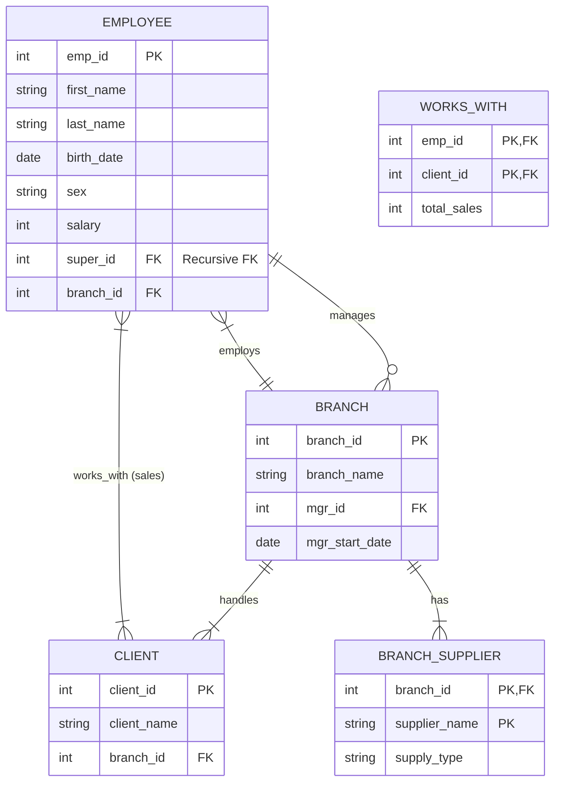

# Lesson 23: ER Diagram Mapping

**Goal:** Take the conceptual ER Diagram we designed and convert it into a logical **Relational Schema** (actual database tables).

-----

## Step 1: Mapping of Regular Entity Types

**Rule:** For each regular entity type, create a relation (table) that includes all the simple attributes of that entity.

  * **Employee Table:** Created with `emp_id` (Primary Key), `first_name`, `last_name`, `birth_date`, `sex`, `salary`.
  * **Branch Table:** Created with `branch_id` (Primary Key), `branch_name`.
  * **Client Table:** Created with `client_id` (Primary Key), `client_name`.

-----

## Step 2: Mapping of Weak Entity Types

**Rule:** For each weak entity type, create a relation (table) that includes all simple attributes of the weak entity.

  * **Primary Key:** The PK of this new table is the **Partial Key** of the weak entity + the **Primary Key** of its owner.

**Example:** `Branch Supplier` (Weak Entity)

  * It belongs to `Branch`.
  * **New Table:** `Branch_Supplier`
  * **Columns:** `branch_id` (from Owner), `supplier_name` (Partial Key), `supply_type`.
  * **PK:** (`branch_id`, `supplier_name`)

-----

## Step 3: Mapping of Binary 1:1 Relationship Types

**Rule:** Include the Primary Key from one side of the relationship as a **Foreign Key** in the other.

  * **Tip:** Favor the side with **Total Participation** (the side that *must* exist).

**Example:** `Manages` (Relationship between `Employee` and `Branch`)

  * A Branch *must* have a manager (Total Participation).
  * **Action:** Add `mgr_id` (which is the `emp_id`) to the **Branch** table.
  * **Attributes:** Add any relationship attributes (like `mgr_start_date`) to this same table.

-----

## Step 4: Mapping of Binary 1:N Relationship Types

**Rule:** Include the **"1" side's** Primary Key as a Foreign Key on the **"N" side** relation (table).

**Example 1:** `Works_For` (Employee works for Branch)

  * **1 Side:** Branch | **N Side:** Employee
  * **Action:** Add `branch_id` to the **Employee** table.

**Example 2:** `Supervision` (Employee supervises Employee)

  * **1 Side:** Supervisor | **N Side:** Supervisee
  * **Action:** Add `super_id` (Recursive Foreign Key) to the **Employee** table.

**Example 3:** `Handles` (Branch handles Client)

  * **1 Side:** Branch | **N Side:** Client
  * **Action:** Add `branch_id` to the **Client** table.

-----

## Step 5: Mapping of Binary M:N Relationship Types

**Rule:** Create a **new relation** (table).

  * **Primary Key:** A combination of both entities' Primary Keys.
  * **Attributes:** Include any relationship attributes here.

**Example:** `Works_With` (Employee sells to Client)

  * **New Table:** `Works_With`
  * **Columns:** `emp_id` (FK), `client_id` (FK), `total_sales`.
  * **PK:** (`emp_id`, `client_id`)

-----

## Final Company Database Schema

Here is the final result of the mapping process represented as a schema diagram.

