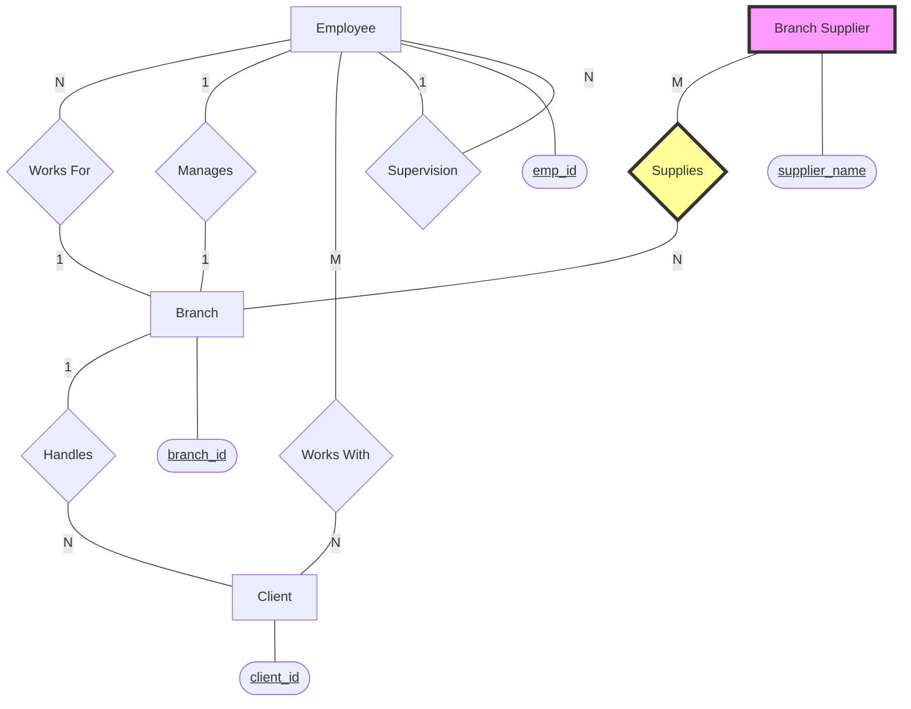

# SQL Database Cource Notes

**References**:
> [SQL Tutorial - Full Database Course for Beginners](https://www.youtube.com/watch?v=HXV3zeQKqGY&ab_channel=freeCodeCamp.org)  
> https://www.mikedane.com/databases/sql/  
> Using PopSQL Software


**Table of Contents**

1.  **Introduction & Theory**
      * [Lesson 1: What is SQL?](https://www.google.com/search?q=%23lesson-1-sql)
      * [Lesson 2: Tables and Keys](https://www.google.com/search?q=%23lesson-2-tables-and-keys)
      * [Lesson 3: SQL Basics](https://www.google.com/search?q=%23lesson-3-sql-basics)
2.  **Installation**
      * [Lesson 4: Windows Installation](https://www.google.com/search?q=%23lesson-4-mysql-windows-installation)
      * [Lesson 5: Mac Installation](https://www.google.com/search?q=%23lesson-5-mysql-mac-installation)
3.  **Basic Database Management (Student DB)**
      * [Lesson 6: Creating Tables](https://www.google.com/search?q=%23lesson-6-creating-tables)
      * [Lesson 7: Inserting Data](https://www.google.com/search?q=%23lesson-7-inserting-data)
      * [Lesson 8: Constraints](https://www.google.com/search?q=%23lesson-8-constraints)
      * [Lesson 9: Update & Delete](https://www.google.com/search?q=%23lesson-9-update--delete)
      * [Lesson 10: Basic Queries](https://www.google.com/search?q=%23lesson-10-basic-queries)
4.  **Complex Database Structure (Company DB)**
      * [Lesson 12: Creating Company Database](https://www.google.com/search?q=%23lesson-12-creating-company-database)
      * [Lesson 13: Basic Queries on Company DB](https://www.google.com/search?q=%23lesson-13-more-basic-queries)
      * [Lesson 14: SQL Functions](https://www.google.com/search?q=%23lesson-14-functions)
      * [Lesson 15: Wildcards](https://www.google.com/search?q=%23lesson-15-wildcards)
5.  **Advanced SQL Operations**
      * [Lesson 16: Unions](https://www.google.com/search?q=%23lesson-16-unions)
      * [Lesson 17: Joins](https://www.google.com/search?q=%23lesson-17-joins)
      * [Lesson 18: Nested Queries](https://www.google.com/search?q=%23lesson-18-nested-queries)
      * [Lesson 19: On Delete Actions](https://www.google.com/search?q=%23lesson-19-on-delete)
      * [Lesson 20: Triggers](https://www.google.com/search?q=%23lesson-20-triggers)
6.  **Database Design & Theory**
      * [Lesson 21: ER Diagrams Intro](https://www.google.com/search?q=%23lesson-21-er-diagrams-intro)
      * [Lesson 22: Designing an ER Diagram](https://www.google.com/search?q=%23lesson-22-designing-an-er-diagram)
      * [Lesson 23: Mapping ER Diagrams](https://www.google.com/search?q=%23lesson-23-er-diagram-mapping)

-----

# Part 1: Introduction & Theory

## Lesson 1: SQL

**SQL (Structured Query Language)** is a language used to interact with **Relational Database Management Systems (RDBMS)**.

### Key Concepts

  * **Database:** Any collection of related information (e.g., Phone Book, Shopping List, Facebook user base). It can be stored on paper, in your mind, or on a computer.
  * **DBMS (Database Management System):** A special software program that helps users create and maintain a database.
  * **CRUD Operations:** The four basic functions of persistent storage:
      * **C**reate
      * **R**ead (Retrieve)
      * **U**pdate
      * **D**elete

### Two Types of Databases

**1. Relational Databases (SQL)**

  * Organize data into one or more **tables**.
  * Each table has **columns** and **rows**.
  * A **unique key** identifies each row.
  * *Examples:* MySQL, Oracle, PostgreSQL, MariaDB.

**2. Non-Relational Databases (NoSQL)**

  * Organize data in formats other than traditional tables.
  * **Key-value stores:** Hash maps.
  * **Documents:** JSON, XML.
  * **Graphs:** Network structures.
  * *Characteristics:* Flexible tables, often used for unstructured data.

> **Wrap Up:**
>
>   * Databases are collections of information.
>   * DBMS makes it easy to manage and secure databases.
>   * Relational databases use SQL and store data in tables (rows/columns).

## Lesson 2: Tables and Keys

In a Relational Database, keys are used to establish relationships between tables and uniquely identify records.

  * **Primary Key:** A unique identifier for a specific row in a table (cannot be NULL).
  * **Foreign Key:** A field that links to the Primary Key of another table (creates relationships).
  * **Surrogate Key:** An artificial key (often a number like 1, 2, 3) that has no business meaning but is used to identify a row.
  * **Natural Key:** A key derived from the data itself (e.g., Social Security Number, Email).
  * **Composite Key:** A key composed of two or more columns to create a unique identifier.

## Lesson 3: SQL Basics

SQL is a hybrid language essentially made up of 4 types of sub-languages:

1.  **DQL (Data Query Language):** Used to fetch data (e.g., `SELECT`).
2.  **DDL (Data Definition Language):** Used to define the schema (e.g., `CREATE`, `DROP`, `ALTER`).
3.  **DCL (Data Control Language):** Used for permissions (e.g., `GRANT`, `REVOKE`).
4.  **DML (Data Manipulation Language):** Used to modify data (e.g., `INSERT`, `UPDATE`, `DELETE`).

**Queries:** A query is a request (set of instructions) made to the DBMS to retrieve specific information.

-----

# Part 2: Installation

## Lesson 4: MySQL Windows Installation

**Required Software:**

  * **Database Engine:** [suspicious link removed]
      * *Instruction:* Install **MySQL Server** and **MySQL Shell** only.
  * **Visualization Tool:** [PopSQL](https://popsql.com/)

## Lesson 5: MySQL Mac Installation

**Required Software:**

  * **Database Engine:** [suspicious link removed]
  * **Guide:** [Mac Installation Tutorial](https://www.mikedane.com/databases/sql/mysql-mac-installation/)

-----

# Part 3: Basic Database Management (Student DB)

## Lesson 6: Creating Tables

> **Note:** The standard workflow is: Define Schema -\> Create Tables -\> Insert Data.

```sql
-- Create the Student table
CREATE TABLE student (
    student_id INT PRIMARY KEY,
    name VARCHAR(20),
    major VARCHAR(20)
);

-- View table structure
DESCRIBE student;

-- Modifying the table
ALTER TABLE student ADD gpa DECIMAL(4, 2);
ALTER TABLE student DROP COLUMN gpa;

-- Deleting the table
DROP TABLE student;
```

## Lesson 7: Inserting Data

```sql
-- Recreate table
CREATE TABLE student (
    student_id INT,
    name VARCHAR(20),
    major VARCHAR(20),
    PRIMARY KEY(student_id)
);

-- Insert all values
INSERT INTO student VALUES(1, 'Jack', 'Biology');
INSERT INTO student VALUES(2, 'Kate', 'Sociology');

-- Insert partial values (Major will be NULL)
INSERT INTO student(student_id, name) VALUES(3, 'Claire');
INSERT INTO student(student_id, name) VALUES(4, 'Claire');
```

## Lesson 8: Constraints

Common constraints: `NOT NULL`, `UNIQUE`, `DEFAULT`, `AUTO_INCREMENT`.

```sql
CREATE TABLE student (
    student_id INT AUTO_INCREMENT,
    name VARCHAR(20) NOT NULL,
    major VARCHAR(20) DEFAULT 'undefined',
    PRIMARY KEY(student_id)
);

-- Testing Constraints
INSERT INTO student(name) VALUES('Jack');                        -- ID: 1, Major: undefined
INSERT INTO student(name, major) VALUES('Kate', 'Sociology');    -- ID: 2
INSERT INTO student(name, major) VALUES('Jack', 'Biology');      -- ID: 3 (Duplicate name allowed)
```

## Lesson 9: Update & Delete

```sql
-- UPDATE: Modify existing data
UPDATE student
SET major = 'Bio'
WHERE major = 'Biology';

UPDATE student
SET major = 'Biochemistry'
WHERE major = 'Bio' OR major = 'Chemistry';

UPDATE student
SET name = 'Tom', major = 'undefined'
WHERE student_id = 1;

-- DELETE: Remove rows
DELETE FROM student
WHERE student_id = 3;

-- DANGER: Deletes all data
DELETE FROM student;
```

## Lesson 10: Basic Queries

```sql
-- Ordering Results
SELECT student.name, student.major
FROM student
ORDER BY name DESC;

-- Limit Results
SELECT *
FROM student
ORDER BY student_id DESC
LIMIT 2;

-- Filtering (WHERE)
SELECT *
FROM student
WHERE major = 'Biology' OR name = 'Kate';

-- Comparison Operators: <, >, <=, >=, =, <> (Not Equal), AND, OR
SELECT *
FROM student
WHERE student_id > 3;

-- IN Operator
SELECT *
FROM student
WHERE name IN ('Clair', 'Kate', 'Mike');
```

-----

# Part 4: Complex Database Structure (Company DB)

## Lesson 12: Creating Company Database

This script sets up the `employee`, `branch`, `client`, `works_with`, and `branch_supplier` tables and their relationships.

```sql
-- 1. Create Employee Table
CREATE TABLE employee (
  emp_id INT PRIMARY KEY,
  first_name VARCHAR(40),
  last_name VARCHAR(40),
  birth_day DATE,
  sex VARCHAR(1),
  salary INT,
  super_id INT,
  branch_id INT
);

-- 2. Create Branch Table
CREATE TABLE branch (
  branch_id INT PRIMARY KEY,
  branch_name VARCHAR(40),
  mgr_id INT,
  mgr_start_date DATE,
  FOREIGN KEY(mgr_id) REFERENCES employee(emp_id) ON DELETE SET NULL
);

-- 3. Add Foreign Keys to Employee
ALTER TABLE employee
ADD FOREIGN KEY(branch_id)
REFERENCES branch(branch_id)
ON DELETE SET NULL;

ALTER TABLE employee
ADD FOREIGN KEY(super_id)
REFERENCES employee(emp_id)
ON DELETE SET NULL;

-- 4. Create Client Table
CREATE TABLE client (
  client_id INT PRIMARY KEY,
  client_name VARCHAR(40),
  branch_id INT,
  FOREIGN KEY(branch_id) REFERENCES branch(branch_id) ON DELETE SET NULL
);

-- 5. Create Works_With Table
CREATE TABLE works_with (
  emp_id INT,
  client_id INT,
  total_sales INT,
  PRIMARY KEY(emp_id, client_id),
  FOREIGN KEY(emp_id) REFERENCES employee(emp_id) ON DELETE CASCADE,
  FOREIGN KEY(client_id) REFERENCES client(client_id) ON DELETE CASCADE
);

-- 6. Create Branch_Supplier Table
CREATE TABLE branch_supplier (
  branch_id INT,
  supplier_name VARCHAR(40),
  supply_type VARCHAR(40),
  PRIMARY KEY(branch_id, supplier_name),
  FOREIGN KEY(branch_id) REFERENCES branch(branch_id) ON DELETE CASCADE
);
```

## Lesson 13: More Basic Queries

```sql
-- Find all employees ordered by salary (High to Low)
SELECT *
FROM employee
ORDER BY salary DESC;

-- Find all employees ordered by sex then name
SELECT *
FROM employee
ORDER BY sex, name;

-- Find the first 5 employees
SELECT *
FROM employee
LIMIT 5;

-- Aliasing Column Names
SELECT first_name AS forename, last_name AS surname
FROM employee;

-- Find distinct genders
SELECT DISTINCT sex
FROM employee;
```

## Lesson 14: Functions

Aggregate functions perform a calculation on a set of values.

```sql
-- COUNT: Number of employees with supervisors
SELECT COUNT(super_id)
FROM employee;

-- AVG: Average Salary
SELECT AVG(salary)
FROM employee;

-- SUM: Total Salary
SELECT SUM(salary)
FROM employee;

-- GROUP BY: Count employees by sex
SELECT COUNT(sex), sex
FROM employee
GROUP BY sex;

-- GROUP BY: Total sales per employee
SELECT SUM(total_sales), emp_id
FROM works_with
GROUP BY client_id;
```

## Lesson 15: Wildcards

Used with the `LIKE` operator.

  * `%` = Any number of characters
  * `_` = One character

<!-- end list -->

```sql
-- Find clients ending in 'LLC'
SELECT * FROM client
WHERE client_name LIKE '%LLC';

-- Find suppliers with 'Label' in the name
SELECT * FROM branch_supplier
WHERE supplier_name LIKE '% Label%';

-- Find employees born in October (Month 10)
-- Format: YYYY-MM-DD
SELECT * FROM employee
WHERE birth_day LIKE '_____10%';

-- Find clients that are schools
SELECT * FROM client
WHERE client_name LIKE '%Highschool%';
```

-----

# Part 5: Advanced SQL Operations

## Lesson 16: Unions

Combines results from multiple SELECT statements.

```sql
-- List of employee names and branch names in one column
SELECT employee.first_name AS Employee_Branch_Names FROM employee
UNION
SELECT branch.branch_name FROM branch;

-- List of client names and supplier names with branch IDs
SELECT client.client_name AS Non-Employee_Entities, client.branch_id AS Branch_ID FROM client
UNION
SELECT branch_supplier.supplier_name, branch_supplier.branch_id FROM branch_supplier;
```

## Lesson 17: Joins

Combines rows from two or more tables based on a related column.

```sql
-- Add the extra branch
INSERT INTO branch VALUES(4, 'Buffalo', NULL, NULL);

-- INNER JOIN: Returns only matching records (Employees who are Managers)
SELECT employee.emp_id, employee.first_name, branch.branch_name
FROM employee
JOIN branch
ON employee.emp_id = branch.mgr_id;

-- LEFT JOIN: Returns all Employees (Left table), matches Branch info if available
SELECT employee.emp_id, employee.first_name, branch.branch_name
FROM employee
LEFT JOIN branch
ON employee.emp_id = branch.mgr_id;

-- RIGHT JOIN: Returns all Branches (Right table), matches Employee info if available
SELECT employee.emp_id, employee.first_name, branch.branch_name
FROM employee
RIGHT JOIN branch
ON employee.emp_id = branch.mgr_id;
```

## Lesson 18: Nested Queries

Queries embedded inside other queries.

```sql
-- Find employees who have sold over 50,000
SELECT employee.first_name, employee.last_name
FROM employee
WHERE employee.emp_id IN (
    SELECT works_with.emp_id
    FROM works_with
    WHERE works_with.total_sales > 50000
);

-- Find clients handled by the branch Michael Scott manages (assuming we don't know his ID)
SELECT client.client_id, client.client_name
FROM client
WHERE client.branch_id = (
    SELECT branch.branch_id
    FROM branch
    WHERE branch.mgr_id = (
        SELECT employee.emp_id
        FROM employee
        WHERE employee.first_name = 'Michael' AND employee.last_name = 'Scott'
        LIMIT 1
    )
);
```

## Lesson 19: On Delete Actions

Defining behavior for Foreign Keys when the parent record is deleted.

1.  **ON DELETE SET NULL:** If the parent is deleted, set the child's foreign key to NULL.
2.  **ON DELETE CASCADE:** If the parent is deleted, delete the child row entirely.

<!-- end list -->

```sql
-- Example: Deleting a Branch
DELETE FROM branch
WHERE branch_id = 2;

-- Result (if CASCADE was set on Supplier table):
SELECT * FROM branch_supplier; -- The rows for Branch 2 are gone.
```

## Lesson 20: Triggers

Automated code blocks that execute on INSERT, UPDATE, or DELETE.

```sql
-- Create a logging table
CREATE TABLE trigger_test (
     message VARCHAR(100)
);

-- Create a Trigger
DELIMITER $$
CREATE
    TRIGGER my_trigger BEFORE INSERT
    ON employee
    FOR EACH ROW BEGIN
         IF NEW.sex = 'M' THEN
               INSERT INTO trigger_test VALUES('added male employee');
         ELSEIF NEW.sex = 'F' THEN
               INSERT INTO trigger_test VALUES('added female employee');
         ELSE
               INSERT INTO trigger_test VALUES('added other employee');
         END IF;
    END$$
DELIMITER ;

-- Test
INSERT INTO employee VALUES(111, 'Pam', 'Beesly', '1988-02-19', 'F', 69000, 106, 3);
SELECT * FROM trigger_test; -- Should show 'added female employee'

-- Cleanup
DROP TRIGGER my_trigger;
```

-----

# Part 6: Database Design & Theory

## Lesson 21: ER Diagrams Intro

**ER (Entity Relationship) Diagrams** are visual tools used to design databases. They convert business requirements into a blueprint for a database schema.

### Core Components

| Component | Symbol | Definition | Example |
| :--- | :--- | :--- | :--- |
| **Entity** | **Rectangle** | An object to store info about. | `Student` |
| **Attribute** | **Oval** | Information about an entity. | `name`, `gpa` |
| **Primary Key** | **Underlined** | Unique identifier attribute. | `<u>student_id</u>` |
| **Relationship** | **Diamond** | Connection between entities. | Student **Takes** Class |

### Advanced Attributes

  * **Composite:** Broken into sub-parts (e.g., Name -\> First, Last).
  * **Multi-valued (Double Oval):** More than one value allowed (e.g., `clubs`).
  * **Derived (Dashed Oval):** Calculated from other data (e.g., `has_honors` from GPA).

## Lesson 22: Designing an ER Diagram

**Case Study: Company Database**

### Requirements

1.  **Employees:** Work for **1** branch, can supervise **N** employees.
2.  **Branches:** Managed by **1** employee.
3.  **Clients:** Handled by **1** branch.
4.  **Works With:** Many-to-Many relationship (Employees sell to Clients).

### Visual Diagram (Mermaid.js)



## Lesson 23: ER Diagram Mapping

The process of converting an ER Diagram into a Relational Schema (Tables).

### The 5 Step Mapping Rules

1.  **Regular Entities:** Create a table for every strong entity (`Employee`, `Branch`, `Client`).
2.  **Weak Entities:** Create a table including the **Owner's Primary Key**.
      * *Example:* `Branch_Supplier` Table includes `branch_id`.
3.  **Binary 1:1 Relationships:** Add the PK of the "Total Participation" side as a FK to the other.
      * *Example:* `Manages` -\> Add `mgr_id` to `Branch`.
4.  **Binary 1:N Relationships:** Add the PK of the "1" side as a FK to the "N" side.
      * *Example:* `Works_For` -\> Add `branch_id` to `Employee`.
5.  **Binary M:N Relationships:** Create a **New Table** with Composite Primary Keys.
      * *Example:* `Works_With` Table (`emp_id`, `client_id`, `total_sales`).
